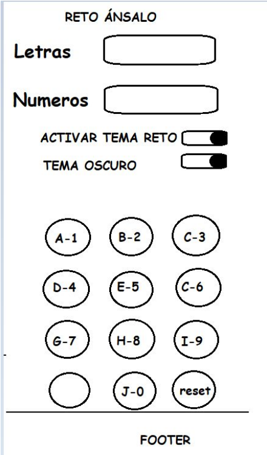
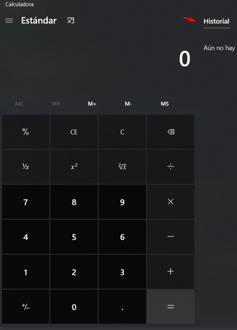

# RETO ÁNSALO  :crossed_swords:

El Reto Ánsalo consiste en la creación de una página web, con un formulario y teclado propio. El usuario debe ingresar una combinación exacta de números y letras, en un orden preciso.

En la primera casilla debe ingresar las letras [A, B, C, D, E, F, G, H, I, J], una vez se cumpla esto en la segunda debe ingresar [1,2,3,4,5,6,7,8,9,0]. Las teclas tienen doble funcionalidad, los números se habilitan una vez se hayan ingresado todas las letras.

## Consideraciones de Diseño :heavy_check_mark:

* El diseño debe ser responsive y puede ser usado CSS puro, Bootstrap o una combinación de ambas.
* Las alertas mostradas deben ser SweetAlert.
* Las casillas donde se ingresa la información deben estar deshabilitadas para ser modificadas usado el cursor, solo se puede usar el teclado de la página.
* Los botones deben ser circulares.

  

* Se debe mostrar una alerta cuando el usuario no ingrese el caracter correcto indicando cuál falta.
* Se debe mostrar un mensaje de finalización cuando el usuario complete exitosamente las dos casillas.

* Se debe contar con 3 temas y su selector:
	* Default: Gris claro
	* Oscuro: Gris oscuro (con selector)
	* Retro: Similar a videojuegos como Minecraft (con selector).

# Calculadora :pager:

* La calculadora debe ser similar a la calculadora de Windows, incluyendo la funcionalidad de guardar en el historial las operaciones previamente realizadas.

  

